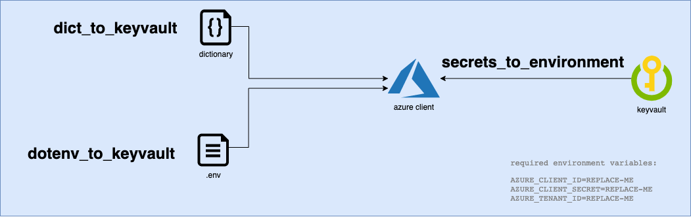

<p align="center">
  
</p>

[](https://pepy.tech/project/keyvault)

[](https://opensource.org/)
[](https://github.com/psf/black)

Azure key vaults
===
> Repository for explaining how to use Azure key vaults in our projects.



## Index
- [Usage](#usage)
    - [Pip install package](#pip-install-this-public-package)
    - [Secrets to environment](#secrets-to-environment)
    - [Get dotenv secrets](#get-dotenv-secrets)
    - [Get keyvault secrets](#get-keyvault-secrets)
    - [Dotenv to keyvault](#dotenv-to-keyvault)
    - [Dict to keyvault](#dict-to-keyvault)
    - [Delete keyvault secrets](#delete-keyvault-secrets)
- [mandatory .env variables](#mandatory-env-variables)

# Usage
This package is designed for easily pulling and creating secrets in Azure key vaults.

## pip install this public package
```.sh
pip install git+ssh://git@github.com/zypp-io/keyvault.git
```

## Secrets to environment
This function sets the keyvault secrets to the runtime environment variables.
This function will only work if you have set the [required environment variables](#mandatory-env-variables)

```python
from keyvault import secrets_to_environment

secrets_to_environment(keyvault_name="mykeyvault")
```


## Get dotenv secrets
Function for reading the local .env file and capturing the secret_name, secret_value as key value pairs.

```python
from keyvault import get_dotenv_secrets

get_dotenv_secrets(dotenv_file=".env")
```


## Get keyvault secrets
This function can be used to pull secrets from the vault. This function will only work if you have
set the [required environment variables](#mandatory-env-variables)

```python
from keyvault import get_keyvault_secrets

secrets = get_keyvault_secrets(keyvault_name="mykeyvault")
# Returns a dictionary containing secret_name, secret_value pairs
```


## dotenv to keyvault
This function is designed for making it easy to upload sensitive project secrets to Azure key vault.
The function reads the `.env` file and uploads the names and values to Azure key vault.

```python
from keyvault import dotenv_to_keyvault

dotenv_to_keyvault(keyvault_name="mykeyvault", dotenv_file=".env")
# Uploads your current .env variables to azure key vault
```

## Dict to keyvault
The function lets you upload a dictionary, where the key-value pairs are the secretname-secretvalues in Azure key vault.

```python
from keyvault import dict_to_keyvault

dict_to_keyvault(keyvault_name="mykeyvault", secret_dict={'SECRET_NAME': 'secret value'})

```
It is also possible to add an expiry date or the content type of the secrets:

```python
from keyvault import dict_to_keyvault
from datetime import datetime, timedelta
expiry_date = datetime.now() + timedelta(days=80)

dict_to_keyvault(
    keyvault_name="mykeyvault",
    secret_dict={'SECRET_NAME': 'secret value'},
    expires_on=expiry_date,
    content_type="text/plain"
)
```

## Delete keyvault secrets
The function lets you delete secrets in the keyvault. Secrets will be deleted with soft_delete enabled.

```python
from keyvault import delete_keyvault_secrets

delete_keyvault_secrets(keyvault_name="mykeyvault", secret_list=["SECRET_NAME"])
```

# mandatory environment variables
There are 3 environment variables that are necessary for authenticating with the azure key vault.
These variables always need to be present in the project in order for the secrets to be retrieved.

```.env
AZURE_CLIENT_ID=REPLACE-ME
AZURE_CLIENT_SECRET=REPLACE-ME
AZURE_TENANT_ID=REPLACE-ME
```
